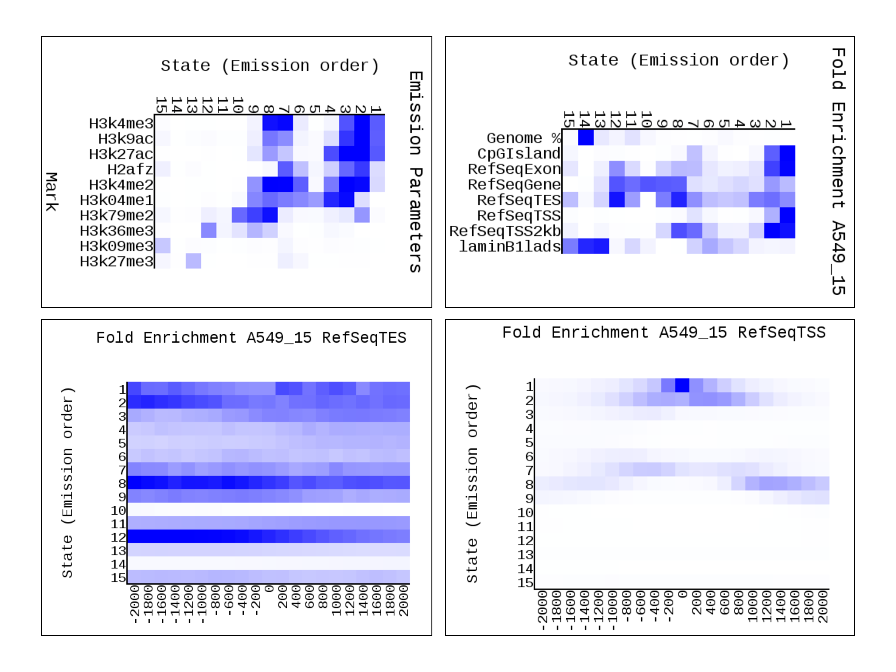
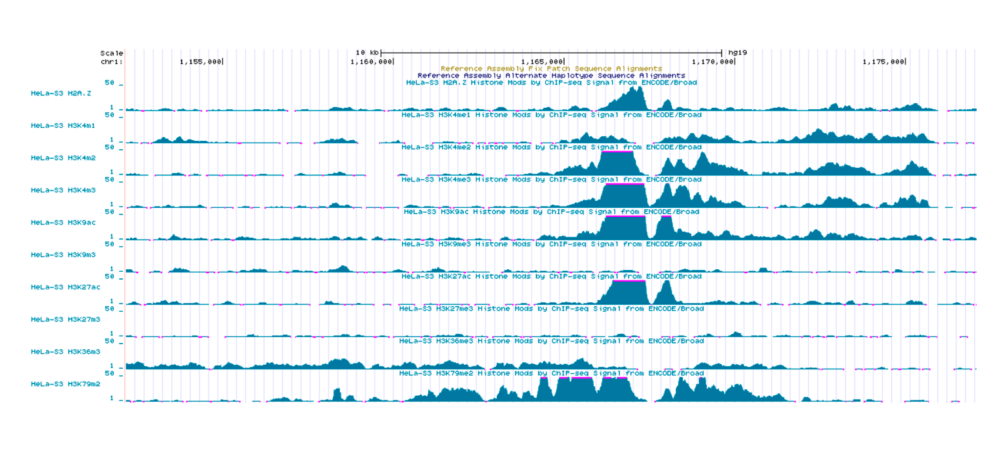

# Аннотация генома человека на разные типы эпигенетических состояний
Зиёев Рустам группа 3

Ссылка на колаб: https://colab.research.google.com/drive/1g-Bdr1m_tJ6aXVQMEMpax0sTyf3sMUln?usp=sharing

### Выбранные гистоновые выравнивания

Метка | Соответствующий файл
--- | ---
H2afz | wgEncodeBroadHistoneHelas3H2azAlnRep1.bam
H3k27ac | wgEncodeBroadHistoneHelas3H3k27acStdAlnRep1.bam
H3k27me3 | wgEncodeBroadHistoneHelas3H3k27me3StdAlnRep1.bam
H3k36me3 | wgEncodeBroadHistoneHelas3H3k36me3StdAlnRep1.bam
H3k04me1 | wgEncodeBroadHistoneHelas3H3k04me1StdAlnRep1.bam
H3k4me2 | wgEncodeBroadHistoneHelas3H3k4me2StdAlnRep1.bam
H3k4me3 | wgEncodeBroadHistoneHelas3H3k4me3StdAlnRep1.bam
H3k79me2 | wgEncodeBroadHistoneHelas3H3k79me2StdAlnRep1.bam
H3k9ac | wgEncodeBroadHistoneHelas3H3k9acStdAlnRep1.bam
H3k09me3 | wgEncodeBroadHistoneHelas3H3k09me3AlnRep1.bam
Контрольный эксперимент | wgEncodeBroadHistoneHelas3ControlStdAlnRep1.bam

### Содержимое файла cellmarkfiletable.txt

A549 | H3k79me2 | H3k79me2.bam | Control.bam
--- | --- | --- | ---
A549 | H3k9ac | H3k9ac.bam | Control.bam
A549 | H3k04me1 | H3k04me1.bam | Control.bam
A549 | H2afz | H2afz.bam | Control.bam
A549 | H3k4me3 | H3k4me3.bam | Control.bam
A549 | H3k27me3 | H3k27me3.bam | Control.bam
A549 | H3k09me3 | H3k09me3.bam | Control.bam
A549 | H3k4me2 | H3k4me2.bam | Control.bam
A549 | H3k27ac | H3k27ac.bam | Control.bam
A549 | H3k36me3 | H3k36me3.bam | Control.bam

### ChromHMM

### GenomeBrowser

### Эпигенетические типы

№	| Тип |	Метки | Положение
--- | --- | --- | ---
1	| Active Promoter	| H4K4me3, H3K9ac, H3K27ac | Intron, Lamina, CpG
2	| Promoter | H3K27ac, H3K9ac, H3K4m3, H3K4m2 | Intron, Exon, Lamina, CpG
3	| Heterochromatin | H2AFZ, H3K4me1, H3K4me2, H3K4me3, H3K9ac, H3K27ac | Lamina, CpG
4	| Heterochromatin | H2AFZ, H3K4me1, H3K4me2, H3K9ac, H3K27ac | Lamina, Exon
5	| Active Promoter | H3K27ac, H3K4me1, H2AFZ | Intron, Exon, Lamina, CpG
6	| Weak enhancer | H3K4me1, H3K4me2, H3K27ac | Intron
7	| Weak enhancer	| H3K27ac, H3K9ac, H3K4me3, H3K4me2 | Intron, Lamina
8	| Weak enhancer	| H3K4me1, H3K4me2, H3K4me3, H3K9ac | Intron, Lamina
9	| Weak enhancer	| H3K4me2, H3K4me3, H3K9ac | Intron, Lamina, CpG
10 | Weak transcribed	| H3K79me2 | Intron
11 | Promoter / Enhancer	| H3K36me3 | Intron, Exon, Lamina
12 | Repressed | H3K27me3 | Intron, Exon, Lamina, CpG
13 | Heterochromatin | H3K4m1, H3K4m2, H3K9ac | Lamina
